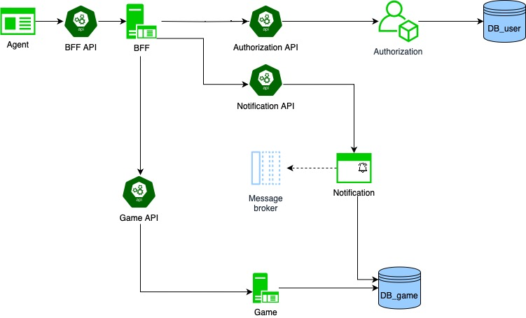

# ДЗ Микросервисная архитектура
## Диаграмма "Архитектура приложения для игры в космический корабль"

### BFF API
* POST /tournament
* GET /tournament

* GET /tournament/rating
* POST /tournament/subscribe

* POST /game
* GET /game
* GET /game/state
* POST /game/subscribe

* POST /command

### Authorization API
* GET /authenticate

### Game API
* POST /tournament
* GET /tournament
* GET /tournament/rating

* POST /game
* GET /game

### Notification API
* POST /game/subscribe
* POST /tournament/subscribe

### Message broker
Топики:
* game_statistic, 
* tournament_statistic, 
* user_statistic, 
* итд

### DB
Таблицы DB_user:
* user (id, user, password_hash, ...), 
* role (id, name, ...), 
* user_role_lnk (id_user, id_role)

Таблицы DB_game: 
* user (id, username, rating, ...), 
* game (id, date, ...), 
* game_state (id, id_game, state_jsonb, ...)
* user_game_lnk (id_user, id_game), 
* tournament (id, date, rating, ...), 
* tournament_game_lnk (id_tournament, id_game), 
* tournament_user_rating (id_tournament, id_user, rating)

## Узкие места и потенциальные проблемы масштабирования приложения и способы их решения
### Узкие места и потенциальные проблемы масштабирования приложения
* Проблема большого числа обращений к приложению
  * Решение - использование нескольких реплик сервисов и балансировщика нагрузки
  * Решение - использование кэширования
  * Решение - асинхронная обработка
* Проблема большого числа обращений к БД
  * Решение - использование дополнительных инстансов
  * Решение - использование шардирования

## Компоненты, к которым чаще всего будут меняться требования и способы выполнения OCP для них
1. АПИ. Решение - версионирование АПИ
2. Новые требования к сервису. Решение - использование паттерна Шаблонный метод.
